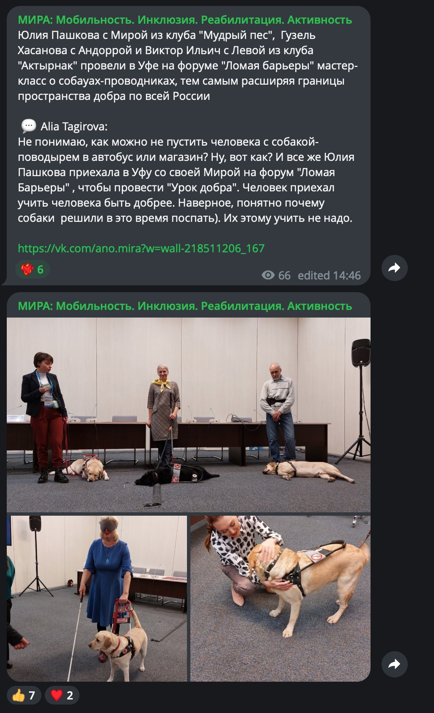

# Бот для автопостинга из группы VK в канал Telegram

Бот автоматически мониторит выбранную группу ВКонтакте на новые записи и перепостит их в указанный канал Telegram. 
Его можно настроить, изменив переменные в файле `.env`
- ВК-ссылки преобразуются в обычный текст
- Параметр включать ссылки в текст или игнорировать их
- Параметр делиться перепостами, при этом текст основного поста и текст перепоста в телеграмме компонуются в общий, но с указанием автора перепоста
- Текст автоматически разбивается по 4096 символ в посте Telegram
- Фотографии автоматически разбиваются по 10 фото за раз
- В связи с ограничениями запросов Telegram, большие блоки данных отправляются каждые 60 секунд
- Проверка на новые посты в VK происходит каждый час
- Ход работы записывается в логи docker
- Видео из VK пока не перебрасывается, при включенных ссылках добавляется указание о видео по ссылке ниже

Пример автопостинга в конце страницы.

## Требования

Для успешной настройки и запуска бота вам потребуется:

- Python 3.10
- Docker
- [Сервисный ключ доступа приложения ВК](https://vk.com/apps?act=manage)
- [Токен вашего tg bot](https://t.me/BotFather), подключенного администратором в вашем Telegram канале


## Установка и настройка

1. Клонируйте этот репозиторий на свой сервер:

    ```bash
    git clone https://github.com/Roodootoo/bot_vk_to_tg.git
    ```

2. Перейдите в каталог с проектом:

    ```bash
    cd bot_vk_to_tg
    ```

3. Переименуйте файл `.env.example` в `.env`. Заполните необходимые переменные окружения:

    ```dotenv
    CHANNEL=ИМЯ_КАНАЛА_ТЕЛЕГРАМ (@example)
    DOMAIN_VK=ДОМЕН_ГРУППЫ_ВК (example.domain)
    COUNT_VK=КОЛИЧЕСТВО_ПОСТОВ_ДЛЯ_ПОДПИСКИ (int)
    INCLUDE_LINK=ДОБАВЛЯТЬ_ССЫЛКИ_В_ТЕКСТ_ПОСТА (boolean)
    PREVIEW_LINK=ДОБАВЛЯТЬ_ПРЕВЬЮ (boolean)
    REPOSTS=ВКЛЮЧАТЬ_ПЕРЕПОСТЫ_ИЗ_ВК (boolean)
    ```

    Замените `ИМЯ_КАНАЛА_ТЕЛЕГРАМ`, `ДОМЕН_ГРУППЫ_ВК` и другие значения на свои.


4. Добавьте файлы с токенами:
   1. Файл с названием `token_vk`:

       ```token_vk
       ВАШ_СЕРВИСНЫЙ_КЛЮЧ_ДОСТУПА_ВК
       ```
   2. Файл с названием `token_tg`:

       ```token_tg
       ВАШ_ТОКЕН_ТЕЛЕГРАМ
       ```

6. Запустите в контейнере:

    ```bash
    docker-compose up --build
    ```

## Пример ВК-поста с перепостом
